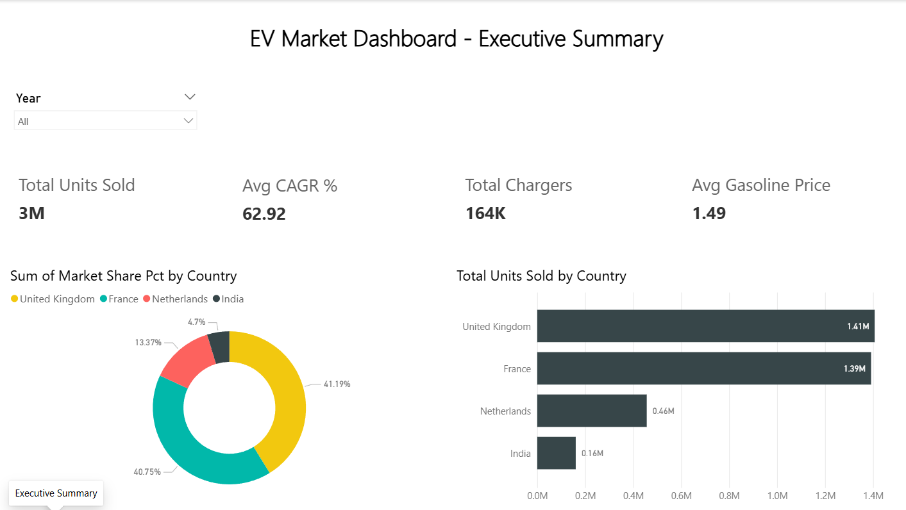
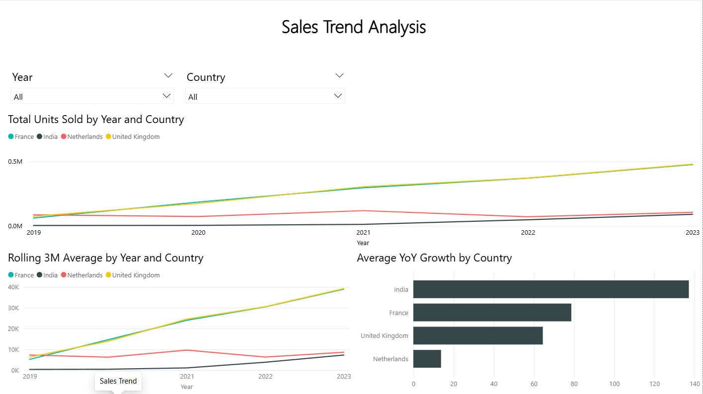
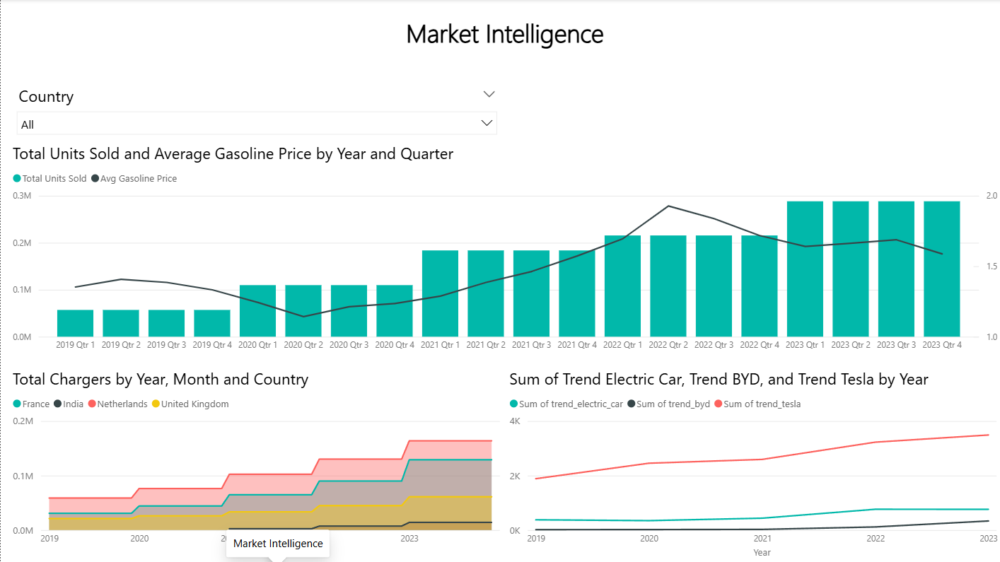
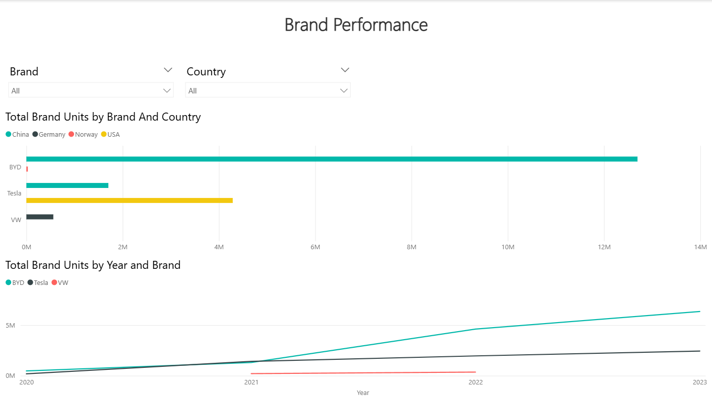

# EV Market Dashboard

An end-to-end data analysis project exploring the global Electric Vehicle (EV) market across 4 countries from 2019 to 2023.

---

## Dashboard Preview

### Executive Summary


### Sales Trend Analysis


### Market Intelligence


### Brand Performance


---

## Project Overview

This project analyzes EV adoption trends across **France, India, Netherlands, and United Kingdom**, covering sales volume, market share, infrastructure growth, and brand competition.

The analysis was conducted in two stages:
1. **Exploratory Data Analysis (EDA)** using Python on Kaggle
2. **Interactive Dashboard** built with Power BI

---

## Key Insights

- **United Kingdom and France** dominate the European EV market with a combined market share of **82%**
- **India** shows the highest growth rate at **120% CAGR** despite having only 4.7% market share — signaling a major emerging market
- **Rising fuel prices in 2021–2022** correlate positively with EV sales growth, demonstrating consumer price sensitivity toward fossil fuels
- **BYD surpassed Tesla** in total volume with 13M+ units vs 2M+ units by 2023, driven by China market dominance
- **Netherlands leads** in EV charging infrastructure despite having mid-tier sales volume

---

## Tools & Technologies

| Tool | Usage |
|------|-------|
| Python (Pandas) | Data cleaning & EDA |
| Kaggle Notebook | Analysis environment |
| Power BI Desktop | Dashboard & visualization |
| DAX | Custom measures & calculations |

---

## Project Structure

```
ev-market-dashboard/
│
├── 📁 data/
│   ├── pbi_fact_sales.csv        # Monthly EV sales per country
│   ├── pbi_fact_brands.csv       # Sales data per brand
│   ├── pbi_dim_date.csv          # Date dimension table
│   └── pbi_summary_country.csv   # Country-level KPI summary
│
├── 📁 screenshots/
│   ├── 01_executive_summary.png
│   ├── 02_sales_trend.png
│   ├── 03_market_intelligence.png
│   └── 04_brand_analysis.png
│
├── ev_dashboard.pbix             # Power BI dashboard file
├── ev_analysis.ipynb             # Python EDA notebook (from Kaggle)
└── README.md
```

---

## Dashboard Pages

| Page | Description |
|------|-------------|
| **Executive Summary** | High-level KPIs, market share donut chart, total units by country |
| **Sales Trend Analysis** | Monthly sales trend, rolling 3M average, YoY growth by country |
| **Market Intelligence** | Fuel price vs EV sales correlation, charger infrastructure, Google Trends |
| **Brand Performance** | BYD vs Tesla vs VW comparison by volume and growth trend |

---

## Dataset

- **Source:** Kaggle
- **Period:** January 2019 – August 2023
- **Countries:** France, India, Netherlands, United Kingdom
- **Brands:** BYD, Tesla, VW

---

## Author

**Zeineddin Bachtiar**  
Aspiring Data Analyst  
📧 zeineddinbachtiar@gmail.com  
🔗 [LinkedIn](https://linkedin.com/in/zeineddin-ahmad-bachtiar)
